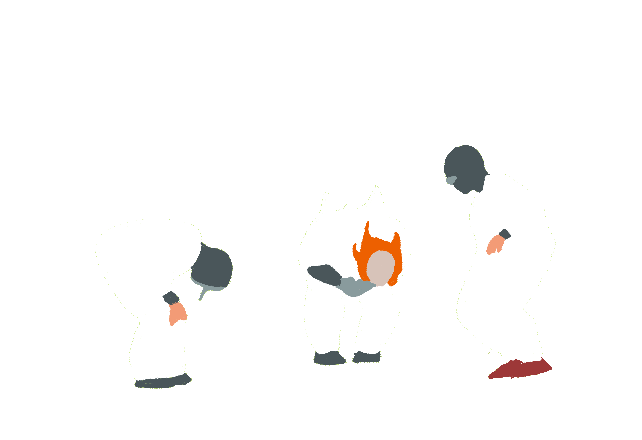

  

##

- 🔭 Hoje trabalho com fluxos de dados em tempo real e APIs
- 🌱 Estudando python
- 😄 Ele/Dele
- ⚡ Sou 3 dias mais velho que o album Bless the Martyr and Kiss the Child, da banda norma jean

##

  ##

<h3 align="left">Minhas redes</h3>

<h3 align="left">Minhas Stacks</h3>

  
  

  ##

<picture align="center">
  <source media="(prefers-color-scheme: dark)" srcset="https://raw.githubusercontent.com/RubenAngelo/RubenAngelo/output/github-contribution-grid-snake-dark.svg">
  <source media="(prefers-color-scheme: light)" srcset="https://raw.githubusercontent.com/RubenAngelo/RubenAngelo/output/github-contribution-grid-snake-dark.svg">
  
</picture>
